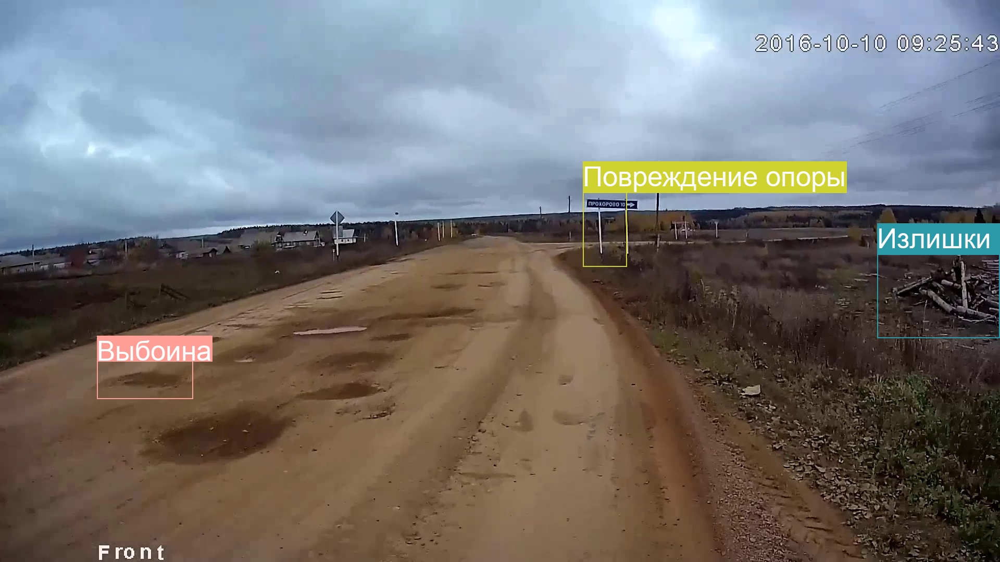

# Система распознавания дефектов на дорогах России

Две версии данной модели на основе Yolov5 предназначены для диагностики и оценки состояния автомобильных дорог. Модель используется для видео из видеорегистраторов, с возможностью прикрепления txt-файлов для привязки к GPS-координатам.

## Список детектируемых классов + расшифровка меток

Базовые классы (в незимнее время года, без снега на дорогах):

* large_pit, small_pit, patch, fissure – «ВЫБОИНА, МАЛАЯ ЯМА, ЗАПЛАТКА, ТРЕЩИНА»
* bad_sign – «ПОВРЕЖДЕНИЕ ОПОРЫ»
  Данный класс включает в себя погнутые, поваленные, ржавые дорожные знаки и столбы освещения
* graffiti – «ГРАФФИТИ», в том числе на остановках общественного транспорта
* bad_road_mark – «СТЕРТАЯ ДОРОЖНАЯ РАЗМЕТКА»
* dirty_stop – «ГРЯЗНАЯ ОСТАНОВКА»
* bad_garden – «НЕУДОВЛ. СОДЕРЖАНИЕ ЦВЕТНИКА»
* overflowing_bin – «ИЗЛИШКИ МУСОРА»В данный класс входят все возможные мусорные загрязнения, в т.ч. переполненные урны, мусорные баки, отдельные кучи и скопления мусора на обочинах
* bad_light – «ЗАГРЯЗНЕНИЕ ОПОРЫ»
  В данный класс входят всевозможные загрязнения, в основном в виде листовок, в т.ч. на столбах освещения, знаках и остановках
* broken_border – «СЛОМАННЫЙ БОРДЮР»

Классы для работы в зимнее время года (перейти в Winter_branch):

* melted_snow – «Зимняя скользкость»
* snow – «Рыхлый снег»
* ice – «Стекловидный лед»
* snow_track – «Снежный накат»
* snow_mud – «Грязь»
* snowdrift – «Снежный вал»
* snowed_sign – «Заснеженный дорожный знак»

## Использование

Видео (с названием без пробелов) помещаются в директорию VIDEO_FOLDER, результат (картинки с объектами без повторений, json с информацией о затедектированных объектах) генерируется в соотв. папках в RESULT. Готовые видео можно найти в runs/exp[номер_эксперимента].

## Примеры работы модели:

  

  

  

  

  

  

